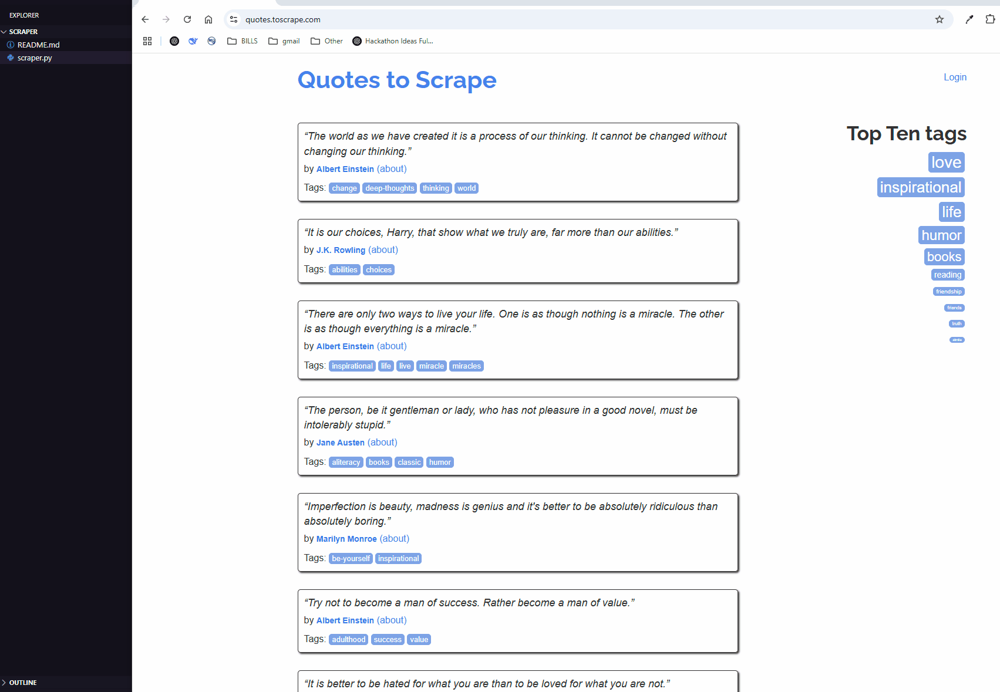

# 🕷️ Python Web Scraper

## 📌 Overview

A modular Python web scraper that extracts quotes, authors, and tags from [https://quotes.toscrape.com](https://quotes.toscrape.com), with support for:

- Multiple pages
- CSV or JSON output
- Command-line arguments
- Retry logic, logging, and polite scraping

---

## 🚀 How to Run

### 1. Clone the Repo or Download Files

```bash
git clone git@github.com:wyu6609/python-scraper.git
cd python-scraper
```

### 2. Install Required Python Packages

```bash
pip install -r requirements.txt
```
### 🚀 Usage
In terminal run:
```
python scraper.py --pages 10 --format json --out results.json 
python scraper.py --pages 10 --format csv --out results.csv
```

### DEMO 

<p align="center"></p>